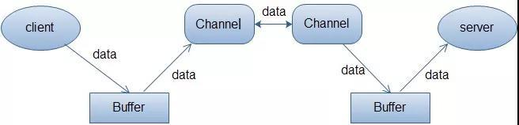

# java.nio

```md
NIO是基于Channel and Buffer进行操作的，数据总是从通道读取到缓冲区中，从缓冲区中写入到通道中。
```

## WhatIs(WhatIs.md)

## Design

* [Buffer 缓冲区](Buffer/README.md)
> * [ByteBuffer](Buffer/ByteBuffer.md)
* [Channel 通道](Channel/README.md)
* [Selector 选择器](Selector/README.md)

* [Charset](Charset/README.md)

## [API](API.md)

## Reference
* [demo-nio](https://github.com/SunnnyChan/java-demo/tree/master/demo-nio)
