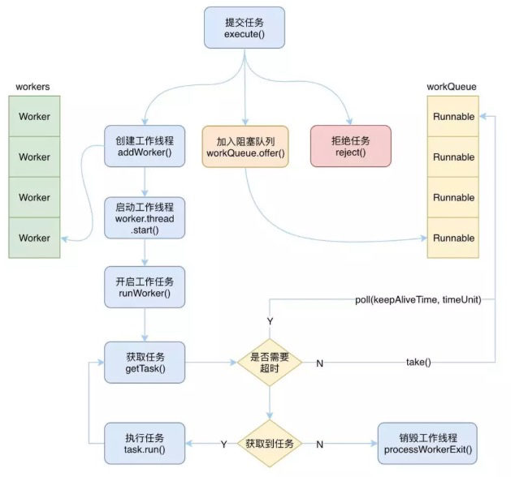
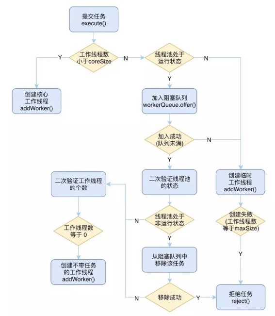

# ThreadPoolExecutor  

* [类结构图 参考](https://github.com/SunnnyChan/sc.drill-code/blob/master/java/java-JDK/JDK/java.util.concurrent/pic/JUC-Thread-Class-Map.png)

```java
private static final int COUNT_BITS = Integer.SIZE - 3;
private static final int CAPACITY   = (1 << COUNT_BITS) - 1;
```

## 线程状态和工作线程数量  

```java
// runState is stored in the high-order bits
private static final int RUNNING    = -1 << COUNT_BITS;
private static final int SHUTDOWN   =  0 << COUNT_BITS;
private static final int STOP       =  1 << COUNT_BITS;
private static final int TIDYING    =  2 << COUNT_BITS;
private static final int TERMINATED =  3 << COUNT_BITS;
```


* RUNNING

运行状态，该状态下线程池可以接受新的任务，也可以处理阻塞队列中的任务
执行 shutdown 方法可进入 SHUTDOWN 状态
执行 shutdownNow 方法可进入 STOP 状态

* SHUTDOWN

待关闭状态，不再接受新的任务，继续处理阻塞队列中的任务
当阻塞队列中的任务为空，并且工作线程数为0时，进入 TIDYING 状态

* STOP

停止状态，不接收新任务，也不处理阻塞队列中的任务，并且会尝试结束执行中的任务
当工作线程数为0时，进入 TIDYING 状态

* TIDYING

整理状态，此时任务都已经执行完毕，并且也没有工作线程
执行 terminated 方法后进入 TERMINATED 状态

* TERMINATED

终止状态，此时线程池完全终止了，并完成了所有资源的释放


### ctl  

```java
 private final AtomicInteger ctl = new AtomicInteger(ctlOf(RUNNING, 0));
```
```java
    // Packing and unpacking ctl
    private static int runStateOf(int c)     { return c & ~CAPACITY; }
    private static int workerCountOf(int c)  { return c & CAPACITY; }
    private static int ctlOf(int rs, int wc) { return rs | wc; }
```

ctl 的高3位（至少需要3位才能表示得了5种状态）用来表示线程池的状态(runState)，低29位用来表示工作线程的个数(workerCnt)

## 核心线程数和最大线程数

创建线程是有代价的，不能每次要执行一个任务时就创建一个线程，
但是也不能在任务非常多的时候，只有少量的线程在执行，这样任务是来不及处理的，
而是应该创建合适的足够多的线程来及时的处理任务。

为了解决这个问题，线程池设计了两个变量来协作。

* corePoolSize
```java
private volatile int corePoolSize;
```

用来表示线程池中的核心线程的数量，也可以称为可闲置的线程数量。

* maximumPoolSize
```java
private volatile int maximumPoolSize;
```
maximumPoolSize 用来表示线程池中最多能够创建的线程数量

## ThreadFactory

## 缓存任务的阻塞队列

当线程池接收到一个任务时，如果工作线程数没有达到corePoolSize，那么就会新建一个线程，并绑定该任务，
直到工作线程的数量达到 corePoolSize 前都不会重用之前的线程。

当工作线程数达到 corePoolSize 了，这时又接收到新任务时，会将任务存放在一个阻塞队列中等待核心线程去执行。

***为什么不直接创建更多的线程来执行新任务?***

核心线程中很可能已经有线程执行完自己的任务了，或者有其他线程马上就能处理完当前的任务，
并且接下来就能投入到新的任务中去，所以阻塞队列是一种缓冲的机制，给核心线程一个机会让他们充分发挥自己的能力。

另外一个值得考虑的原因是，创建线程毕竟是比较昂贵的，不可能一有任务要执行就去创建一个新的线程。

所以我们需要为线程池配备一个阻塞队列，用来临时缓存任务，这些任务将等待工作线程来执行。

* 有界的队列

如果是有界队列，那么当阻塞队列中装满了等待执行的任务，这时再有新任务提交时，
线程池就需要创建新的“临时”线程来处理，相当于增派人手来处理任务。

* 无界的队列

如果是无界队列，那么当核心线程都在忙的时候，所有新提交的任务都会被存放在该无界队列中，
这时最大线程数将变得没有意义，因为阻塞队列不会存在被装满的情况。

## 非核心线程存活时间

有界队列时，创建的“临时”线程是有存活时间的。
不可能让他们一直都存活着，当阻塞队列中的任务被执行完毕，并且又没有那么多新任务被提交时，“临时”线程就需要被回收销毁，
在被回收销毁之前等待的这段时间，就是非核心线程的存活时间，也就是 keepAliveTime 属性。

***那么什么是“非核心线程”呢？是不是先创建的线程就是核心线程，后创建的就是非核心线程呢？***

其实核心线程跟创建的先后没有关系，而是跟工作线程的个数有关，
如果当前工作线程的个数大于核心线程数，那么所有的线程都可能是“非核心线程”，都有被回收的可能。

一个线程执行完了一个任务后，会去阻塞队列里面取新的任务，在取到任务之前它就是一个闲置的线程。

取任务的方法有两种，
一种是通过 take() 方法一直阻塞直到取出任务，
另一种是通过 poll(keepAliveTime，timeUnit) 方法在一定时间内取出任务或者超时，
如果超时这个线程就会被回收，请注意核心线程一般不会被回收。  

***那么怎么保证核心线程不会被回收呢？***

还是跟工作线程的个数有关，每一个线程在取任务的时候，线程池会比较当前的工作线程个数与核心线程数：

如果工作线程数小于当前的核心线程数，则使用第一种方法取任务，也就是没有超时回收，这时所有的工作线程都是“核心线程”，他们不会被回收；
如果大于核心线程数，则使用第二种方法取任务，一旦超时就回收，所以并没有绝对的核心线程，只要这个线程没有在存活时间内取到任务去执行就会被回收。

所以每个线程想要保住自己“核心线程”的身份，必须充分努力，尽可能快的获取到任务去执行，这样才能逃避被回收的命运。

核心线程一般不会被回收，但是也不是绝对的，如果我们设置了允许核心线程超时被回收的话，
那么就没有核心线程这种说法了，所有的线程都会通过 poll(keepAliveTime, timeUnit) 来获取任务，
一旦超时获取不到任务，就会被回收，一般很少会这样来使用，除非该线程池需要处理的任务非常少，并且频率也不高，不需要将核心线程一直维持着。

## 拒绝策略

虽然我们有了阻塞队列来对任务进行缓存，这从一定程度上为线程池的执行提供了缓冲期，
但是如果是有界的阻塞队列，那就存在队列满的情况，也存在工作线程的数据已经达到最大线程数的时候。
如果这时候再有新的任务提交时，显然线程池已经心有余而力不足了，
因为既没有空余的队列空间来存放该任务，也无法创建新的线程来执行该任务了，所以这时我们就需要有一种拒绝策略，即 handler。

拒绝策略是一个 RejectedExecutionHandler 类型的变量，
用户可以自行指定拒绝的策略，如果不指定的话，线程池将使用默认的拒绝策略：抛出异常。

在线程池中还为我们提供了很多其他可以选择的拒绝策略：
直接丢弃该任务
使用调用者线程执行该任务
丢弃任务队列中的最老的一个任务，然后提交该任务

## 工作流程  

  

### 提交任务

当向线程池提交一个新的任务时，线程池有三种处理情况，分别是：
创建一个工作线程来执行该任务、将任务加入阻塞队列、拒绝该任务。

1. 当工作线程数小于核心线程数时，直接创建新的核心工作线程
2. 当工作线程数不小于核心线程数时，就需要尝试将任务添加到阻塞队列中去
3. 如果能够加入成功，说明队列还没有满，那么需要做以下的二次验证来保证添加进去的任务能够成功被执行
4. 验证当前线程池的运行状态，如果是非RUNNING状态，则需要将任务从阻塞队列中移除，然后拒绝该任务
5. 验证当前线程池中的工作线程的个数，如果为0，则需要主动添加一个空工作线程来执行刚刚添加到阻塞队列中的任务
6. 如果加入失败，则说明队列已经满了，那么这时就需要创建新的“临时”工作线程来执行任务
7. 如果创建成功，则直接执行该任务
8. 如果创建失败，则说明工作线程数已经等于最大线程数了，则只能拒绝该任务了

  

### 创建工作线程

创建工作线程需要做一系列的判断，需要确保当前线程池可以创建新的线程之后，才能创建。

首先，当线程池的状态是 SHUTDOWN 或者 STOP 时，则不能创建新的线程。
另外，当线程工厂创建线程失败时，也不能创建新的线程。
当前工作线程的数量与核心线程数、最大线程数进行比较，如果前者大于后者的话，也不允许创建。
会尝试通过 CAS 来自增工作线程的个数，如果自增成功了，则会创建新的工作线程，即 Worker 对象。
然后加锁进行二次验证是否能够创建工作线程，最后如果创建成功，则会启动该工作线程。

### 启动工作线程

当工作线程创建成功后，也就是 Worker 对象已经创建好了，这时就需要启动该工作线程，让线程开始干活了，
Worker 对象中关联着一个 Thread，所以要启动工作线程的话，只要通过 worker.thread.start() 来启动该线程即可。

启动完了之后，就会执行 Worker 对象的 run 方法，因为 Worker 实现了 Runnable 接口，所以本质上 Worker 也是一个线程。

通过线程 start 开启之后就会调用到 Runnable 的 run 方法，在 worker 对象的 run 方法中，
调用了 runWorker(this) 方法，也就是把当前对象传递给了 runWorker 方法，让他来执行。

### 获取任务并执行

在 runWorker 方法被调用之后，就是执行具体的任务了，首先需要拿到一个可以执行的任务，
而 Worker 对象中默认绑定了一个任务，如果该任务不为空的话，那么就是直接执行。

执行完了之后，就会去阻塞队列中获取任务来执行，而获取任务的过程，需要考虑当前工作线程的个数。

如果工作线程数大于核心线程数，那么就需要通过 poll 来获取，因为这时需要对闲置的线程进行回收；
如果工作线程数小于等于核心线程数，那么就可以通过 take 来获取了，
因此这时所有的线程都是核心线程，不需要进行回收，前提是没有设置 allowCoreThreadTimeOut
