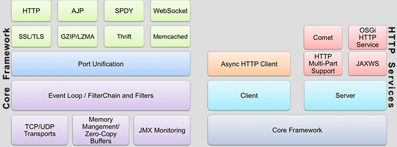

# [Grizzly](https://javaee.github.io/grizzly/)

```md
NIO Event Development Simplified
利用Java NIO API，构建强大的可扩展的服务器应用
	The Grizzly NIO framework has been designed to help developers 
	to take advantage of the Java™ NIO API. 
并提供扩展框架的组件：Web框架（HTTP/S）、WebSocket、Comet等
```
```md
grizzly
英 ['grɪzlɪ]  美 ['grɪzli] 
adj. 灰色的
n. 灰熊
```



* 核心框架
```md
内存管理
I/O策略
传输和连接
过滤器链和过滤器
核心配置
端口统一
监控
```
* HTTP组件
```md
核心HTTP框架
	Grizzly2.3 HTTP框架提供了服务器和客户端的编解码HTTP请求响应数据的功能。
	除了编解码器本身，框架还包括基本HTTP原语和简化协议相关工作的工具类。
HTTP服务器框架
	简单的服务器API使Grizzly可以轻松嵌入应用程序。
	类似Servlet规范的抽象
		HttpHandler (Servlet), Request (HttpServletRequest), Response (HttpServletResponse)。
	通过响应挂起/恢复机制提供处理长时间运行的HTTP事务的能力。
	支持非阻塞IO流。
	静态内容的使用文件缓存。
HTTP服务器框架扩展
Comet
	基于 HTTP 长连接的“服务器推”技术
		需要服务器能实时地将更新的信息传送到客户端，而无须客户端发出请求。
	解决方案
		一类需要在浏览器端安装插件，基于套接口传送信息，或是使用 RMI、CORBA 进行远程调用
		另一类则无须浏览器安装任何插件、基于 HTTP 长连接。
JAXWS
	从2.1.2版本开始Grizzly通过HTTP服务器框架支持JAX-WS web服务。
WebSockets
	Grizzly实现了RFC 6455的要求，同时也支持此协议的旧版本。
		这对于没有实现最终草案规范的客户端很有用。
AJP
	从2.1版本开始Grizzly开始支持AJP1.3。
	AJP 全称 Apache JServ Protocol， 是定向包协议
		使用二进制格式来传输可读性文本，WEB服务器通过TCP连接和SERVLET容器连接。
SPDY
	从2.3版本开始Grizzly支持SPDY/3。SPDY的目标是降低网页加载时间。
	SPDY（读作“SPeeDY”）是Google开发的基于TCP的应用层协议，用以最小化网络延迟，提升网络速度，优化用户的网络使用体验。
		SPDY并不是一种用于替代HTTP的协议，而是对HTTP协议的增强。
	新协议的功能包括数据流的多路复用、请求优先级以及HTTP报头压缩。
	谷歌表示，引入SPDY协议后，在实验室测试中页面加载速度比原先快64%。
```

## Reference
* [Comet：基于 HTTP 长连接的“服务器推”技术](https://www.ibm.com/developerworks/cn/web/wa-lo-comet/)
