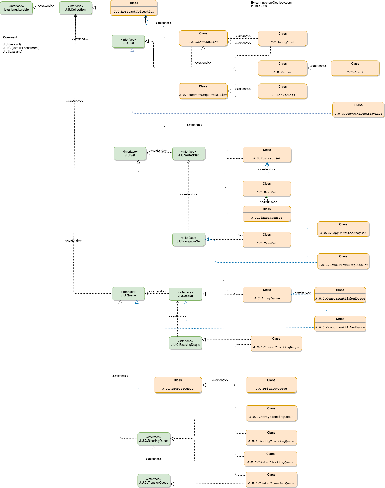
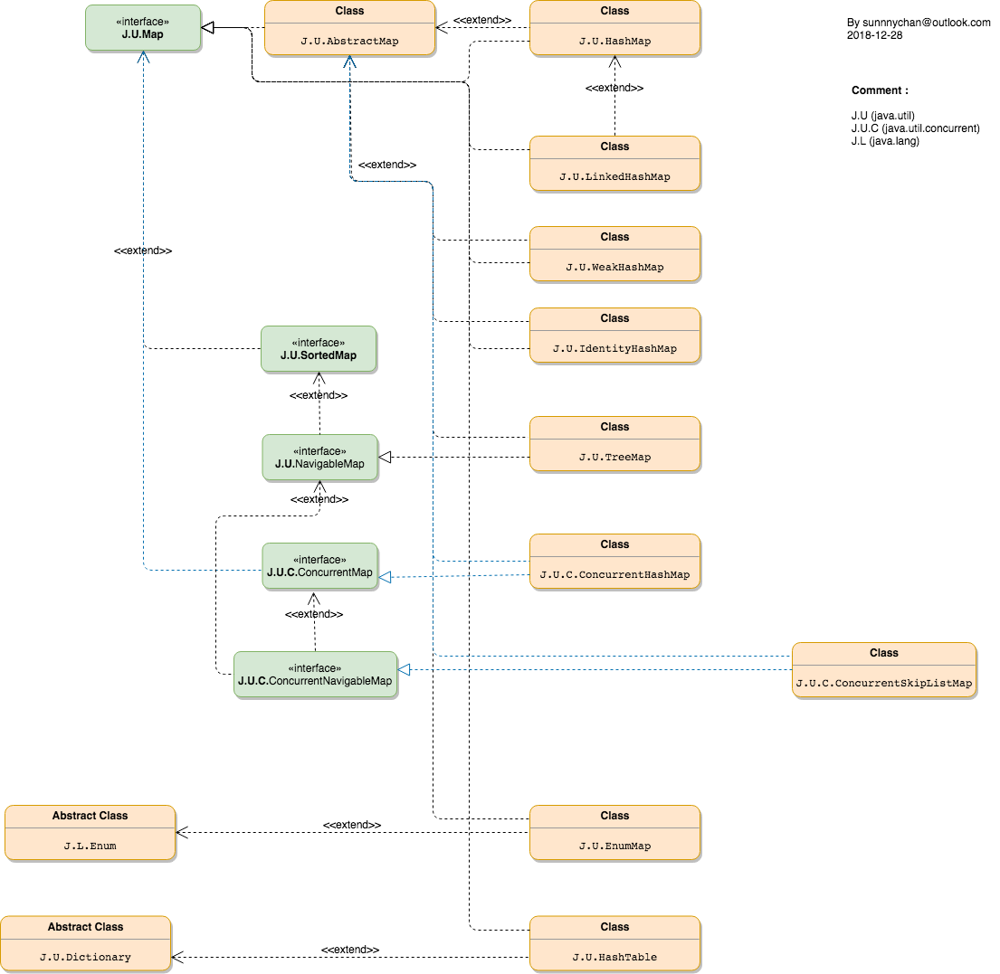

# Java Container

## interface
* [java.util.Collection](interface/java.util.Collection.md)

* [java.util.List](interface/java.util.List.md)

* [java.util.Set](interface/java.util.Set.md)
* [java.util.SortedSet](interface/java.util.SortedSet.md)
* [java.util.NavigableSet](interface/java.util.NavigableSet.md)

* [java.util.Queue](interface/java.util.Queue.md)
* [J.C.U.BlockingQueue](interface/J.C.U.BlockingQueue.md)
* [J.C.U.TransferQueue](interface/J.C.U.TransferQueue.md)
* [java.util.Deque](interface/java.util.Deque.md)
* [J.C.U.BlockingDeque](interface/J.C.U.BlockingDeque)

* [java.util.Map](interface/java.util.Map.md)
* [java.util.SortedMap](interface/java.util.SortedMap.md)
* [java.util.NavigableMap](interface/java.util.NavigableMap.md)

## Class
### Abstract Class
* [AbstractList]()
* [AbstractSequentialList]()

### Implemention Class

#### [List](class/list/README.md)
* [java.util.ArrayList](class/list/java.util.ArrayList.md)

#### [Map](class/map/README.md)
* java.util.HashMap
* JUC.ConcurrentHashMap

#### [Set](class/set/README.md)
* java.util.HashSet

#### [Queue](class/queue/README.md)
* ArrayDeque（数组双端队列） 
* PriorityQueue（优先级队列） 
* ConcurrentLinkedQueue（基于链表的并发队列） 
* DelayQueue（延期阻塞队列）（阻塞队列实现了BlockingQueue接口） 
* ArrayBlockingQueue（基于数组的并发阻塞队列）
* LinkedBlockingQueue（基于链表的FIFO阻塞队列） 
* LinkedBlockingDeque （基于链表的FIFO双端阻塞队列） 
* PriorityBlockingQueue （带优先级的无界阻塞队列） 
* SynchronousQueue （并发同步阻塞队列）

## Class Graph
### Collections Class Graph

### Map Class Graph
