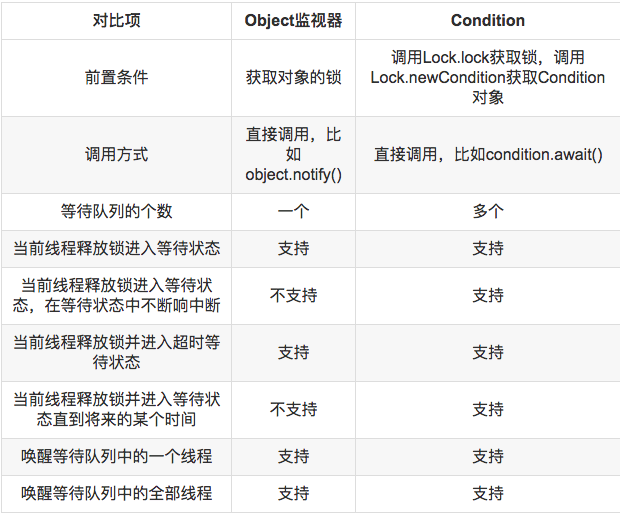

# Condition
```md
Condition从拥有监控方法（wait,notify,notifyAll）的Object对象中抽离出来成为独特的对象，
高效的让每个对象拥有更多的等待线程。
和锁对比起来，如果说用Lock代替synchronized，那么Condition就是用来代替Object本身的监控方法。

Condition实例跟Object本身的监控相似，同样提供wait()方法让调用的线程暂时挂起让出资源，
直到其他线程通知该对象转态变化，才可能继续执行。
Condition实例来源于Lock实例，通过Lock调用newCondition()即可。
Condition较Object原生监控方法，可以保证通知顺序。
```
```md
	Condition 是一个接口
	Condition 接口的实现类是 Lock（AQS）中的 ConditionObject
	Lock 接口中有个 newCondition() 方法
		通过这个方法可以获得 Condition 对象（其实就是 ConditionObject）
	因此，通过 Lock 对象可以获得 Condition 对象
		Lock lock  = new ReentrantLock();
Condition c1 = lock.newCondition();
Condition c2 = lock.newCondition();
```
* vs. Object提供的等待通知
```md
		在java中，对于任意一个java对象
			它都拥有一组定义在java.lang.Object上监视器方法
		包括wait()，wait(long timeout)，notify()，notifyAll()
		这些方法配合synchronized关键字一起使用可以实现等待/通知模式
	与Object对象里不同的是
		Condition更加灵活
			可以在一个Lock对象里创建多个Condition实例
		有选择的进行线程通知，在线程调度上更加灵活
```


* 场景
```md
线程A执行到某个点的时候，因为某个条件condition不满足，需要线程A暂停，
等到线程B修改了条件condition，使condition满足了线程A的要求时，A再继续执行。
```