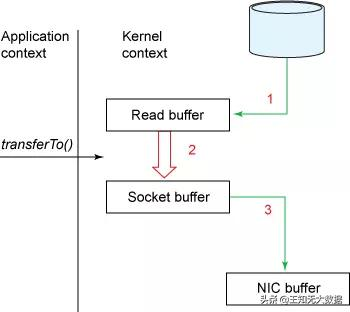

# Zero-Copy

```md
在Java NIO 包中提供了零拷贝机制对应的API，即FileChannel.transferTo()方法。
不过FileChannel类是抽象类，transferTo()也是一个抽象方法，因此还要依赖于具体实现。
FileChannel的 实现类并不在JDK本身，而位于sun.nio.ch.FileChannelImpl类中，零拷贝的具体实现自然也都是native方法
```
```java
SocketAddress socketAddress = new InetSocketAddress(HOST, PORT);
SocketChannel socketChannel = SocketChannel.open();
socketChannel.connect(socketAddress);
File file = new File(FILE_PATH);
FileChannel fileChannel = new FileInputStream(file).getChannel();
fileChannel.transferTo(0, file.length(), socketChannel);
fileChannel.close();
socketChannel.close();
```



## Reference
* [Zero-Copy](https://github.com/SunnnyChan/knowledge-Sys-of-CSA/blob/master/network/IO/zero-copy.md)